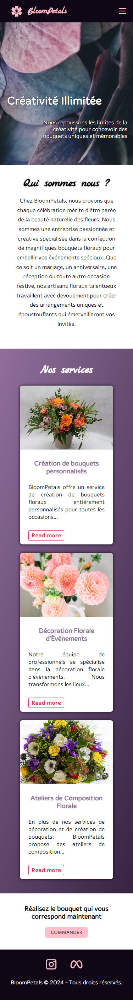
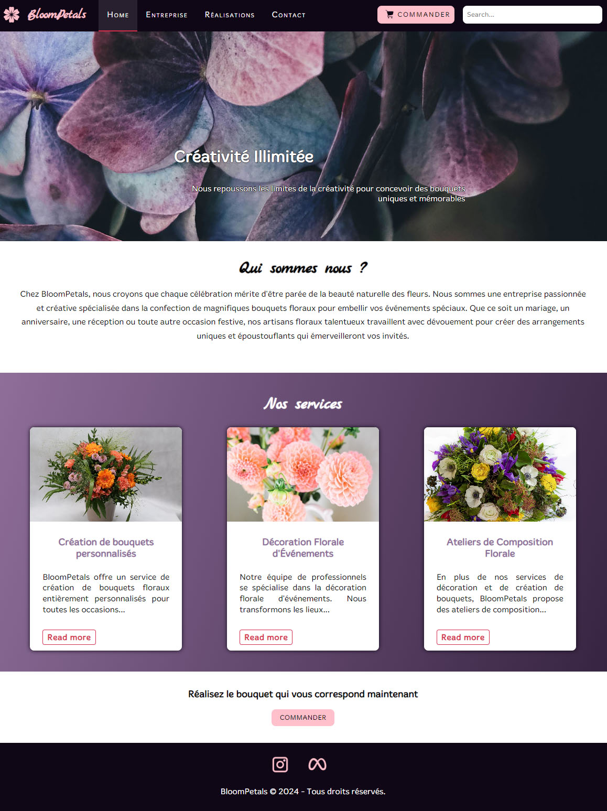

# 🌸 Bloom Petals
First HTML and CSS project for school.

## 📝 Instruction
1. Create a website for a fake florist named Bloom Petal
2. Create 4 pages : home page, the team, a galerie and a contact page

 
### <u>Color used :</u>
| Color             | Hex                                                                |
| ----------------- | ------------------------------------------------------------------ |
| Dark purple |  #100716 |
| Purple |  #362341 |
| Light purple |  #8f6e9a |
| Light pink |  #ffc0cb |

### <u>Preview :</u>
 
